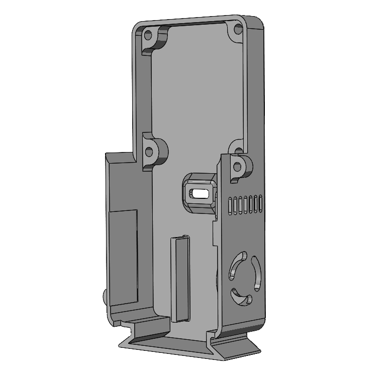
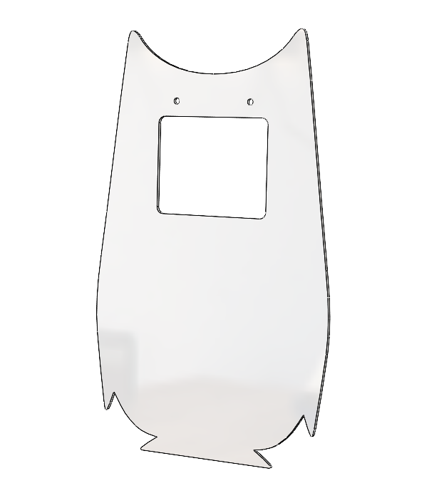
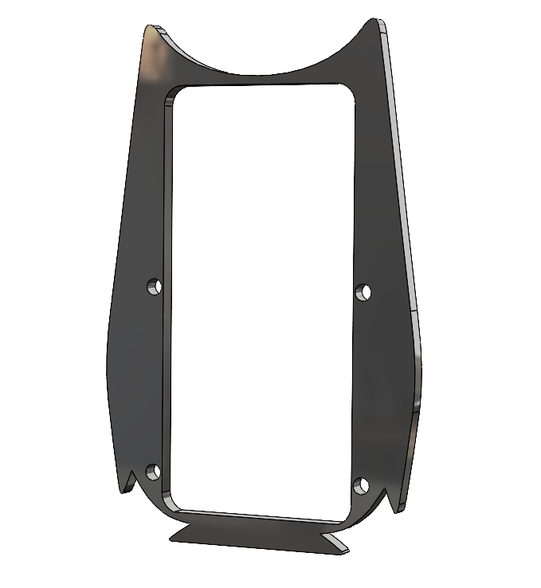

# Design files

## 3MF File for 3D Printing

### Suggestions for 3D printing
- **Material**: PLA+
- **Color**: Matte Black
- **Print Quality**:
  - 0.15mm layer for 0.4mm nozzle
  - Use 0.08mm layer for better quality

## DXF Files for Laser Cutting

- **Transparent Acrylic Sheet (Front Facia)**
  - Thickness: 1mm ± 0.2mm

- **Black Acrylic Sheet (Front Facia)**
  - Thickness: 5mm

 

## PDF File for UV Printing

- **Print on transparent Acrylic Sheet**
  - **Color**: Black

