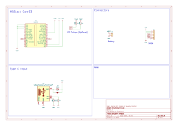
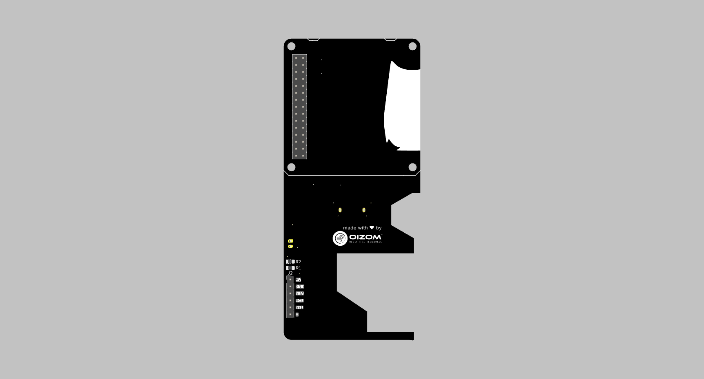
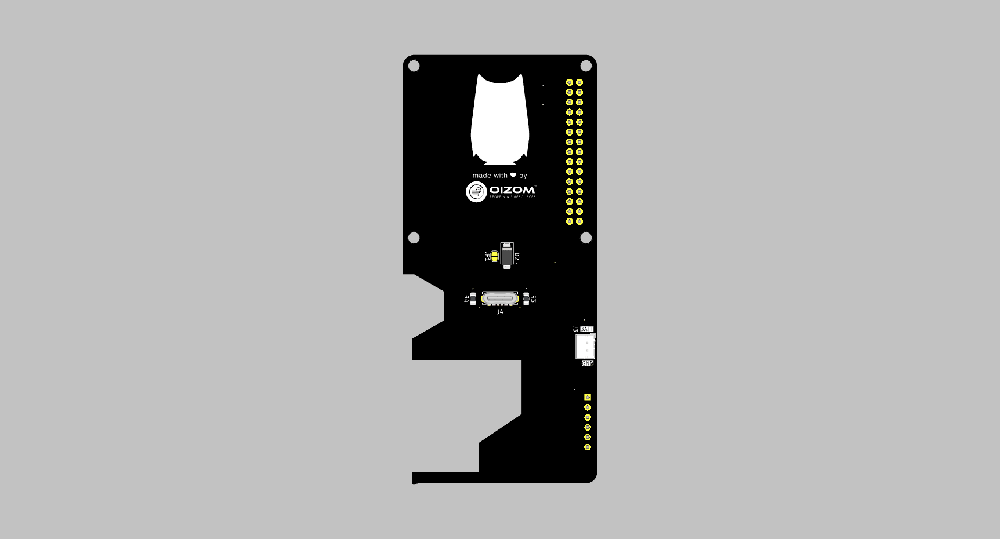

# Open Source PCB Design for M5Stack and Sensirion Dust Sensor SN54


This repository contains the open-source PCB design created using **KiCAD** software. The design includes both the schematic and the PCB layout.

---

## Table of Contents
- [Project Overview](#project-overview)
- [Key Features](#key-features)
- [Schematic and PCB Design](#schematic-and-pcb-design)
  - [Schematic](#schematic)
  - [Rendered PCB Images](#rendered-pcb-images)
- [Bill of Materials (BOM)](#bill-of-materials-bom)
- [How to Use](#how-to-use)
- [Contributing](#contributing)
- [License](#license)

---

## Project Overview

This PCB design integrates the **M5Stack** and the **Sensirion Dust Sensor SN54**, which measures the following parameters:

- **PM1**
- **PM2.5**
- **PM10**
- **Temperature**
- **Humidity**
- **TVOC Index**

The design facilitates I2C communication between the M5Stack and the dust sensor, with electrical connections labeled and organized for simplicity.

### Key Features

- **I2C Communication**: The M5Stack communicates with the Sensirion Dust Sensor via I2C.
- **Type-C Power Supply**: The entire PCB is powered through a Type-C connector.
- **Sensor Connections**: The wires from the sensor are soldered onto the PCB, with labeled footprints for I2C and 5V power connections.

---

## Schematic and PCB Design

The repository includes:

- **Schematic**: Showing the connection between M5Stack and Sensirion Dust Sensor SN54.
- **PCB Design**: Footprint and layout for soldering sensor wires and powering the device.

### Schematic

<details>
  <summary>Click to expand Schematic image</summary>
  
  

</details>

### Rendered PCB Images

- **Front View**



- **Back View**


---

## Bill of Materials (BOM)

| Part Name                   | Quantity | Reference Link |
|-----------------------------|----------|-----------|
| **M5Stack CoreS3-SE**        | 1        |   <a href="https://shop.m5stack.com/products/m5stack-cores3-se-iot-controller-w-o-battery-bottom" target="_blank">Link</a>        |
| **Sensirion Dust Sensor SEN54**| 1        |  <a href="https://www.digikey.in/en/products/detail/sensirion-ag/SEN54-SDN-T/15903868?s=N4IgTCBcDaIAQGUCiA5ArAFgLQICIqwBUQBdAXyA" target="_blank">Link</a> |          
| **Type-C Connector**         | 1        |  <a href="https://www.digikey.in/en/products/detail/same-sky/UJC-VP-3-SMT-TR/14310522?cur=INR&lang=en&utm_adgroup=&utm_source=google&utm_medium=cpc&utm_campaign=PMax%20Shopping_Product_High%20ROAS&utm_term=&productid=14310522&utm_content=&utm_id=go_cmp-20122528480_adg-_ad-__dev-c_ext-_prd-14310522_sig-CjwKCAjwmaO4BhAhEiwA5p4YL3F-XqxnqejDD6ez2iOCmQ-_p37bMZnp_VDgZ_CJA0CgT0X3qvwMexoCO9gQAvD_BwE&gad_source=1&gclid=CjwKCAjwmaO4BhAhEiwA5p4YL3F-XqxnqejDD6ez2iOCmQ-_p37bMZnp_VDgZ_CJA0CgT0X3qvwMexoCO9gQAvD_BwE">Link</a>         |                       
| **I2C Pull-up Resistors [R1, R2]**    | 2        | 10K 0805 (Optional)          |                                 
| **Resistors [R3, R4]**                | 2        | 4.7K 0805 (Must for Type C PD)         |         
| **Male Header Pin**                | 1        | 2.54mm 40x2 Male Header Pin         |             
| **Sensirion Dust Sensor Cable**                | 1       | <a href="https://evelta.com/jst-ghr-06v-cable-6pin-1-25mm-pitch-female-connector-15cm/" target="_blank">Link</a>         |             

> **Note:** This table will be updated with detailed part information.

---

## How to Use

To get started with this PCB design:

```bash
# Step 1: Clone the repository
git clone https://github.com/your-repo-name.git

# Step 2: Open the project in KiCAD
