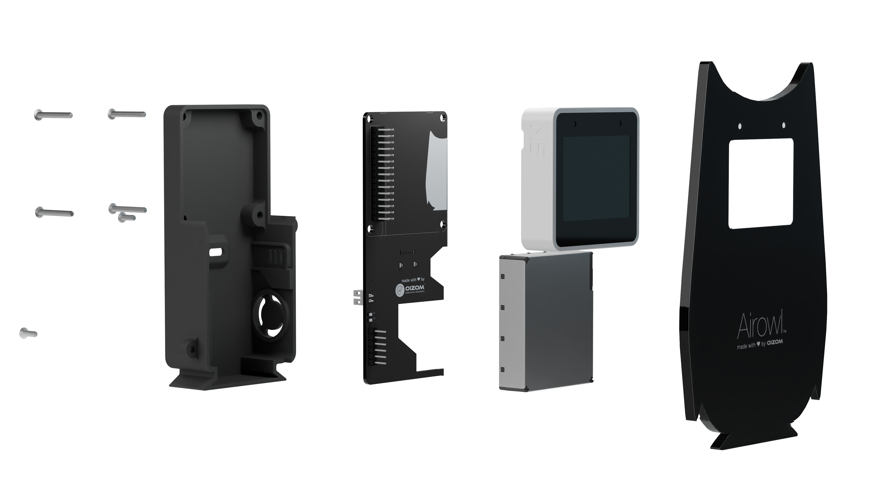

# **AIROWL**

The OIZOM Airowl is an indoor Air Quality Measurement device comprising of the ESP32 S3 powered M5stack Core S3 SE, which integrates the aforementioned controller chip, with a 320 x 240 LCD screen supporting capacitive touch, along with a speaker and the AXP2101 power management chip.

This Repository serves as the source of the complete Airowl, consisting of its Firmware source files, 3D files and PCB design Files.

This file provides instructions to assemble the individual components of the Airowl, along with its Bill of Materials (BOM).

The BOM for the Airowl is as Follows:

| SR. | ITEM DESCRIPTION       | NOTES                                  | Qty | Product Links                                                 |
|-----|------------------------|----------------------------------------|-----|---------------------------------------------------------------|
| 1   | M5 STACK              | SCREEN                                 | 1   | <a href="https://shop.m5stack.com/products/m5stack-cores3-se-iot-controller-w-o-battery-bottom" target="_blank">Link</a> |
| 2   | FRONT FACIA      | UV FRONT 1.3 MM + REAR BLACK 5 MM      | 1   | [Front](/Designfiles/Frontfacia)                                             |
| 3   | 3D PRINT BACK CASE    | BLACK MATTLE 3D PRINTED CASE           | 1   | [Back](/Designfiles/Backcover)                                          |
| 4   | FASTENERS             | M3 X 8 mm PHILIPS HEAD (SS)            | 2   |                                                               |
| 5   | FASTENERS             | M3 X 20 mm CSK Blunted (SS)            | 2   |                                                               |
| 6   | FASTENERS             | M3 X 25 mm CSK Blunted (SS)            | 2   |                                                               |
| 7   | Screw Driver (+)      | Mini Screw Driver                      | 1   |                                                               |
| 8   | TYPE C - TYPE C CABLE | PORTRONICS TYPE C CABLE                | 1   |                                                               |

More details of the individual components can be found as followed:

[PCB files](/Mountingboard/)

[Firmware](/Firmware)

[Squareline studio project files](/squareline/) 

[Design Files](/Designfiles/)

## Assembling the Airowl

The following is a cross sectional view of the Airowl dpicting its individual components and the way that they must be connected:

From left to right, we can observe the parts as follows:

1. Screws
2. [3D printed Black Case](Images/16.png)
3. [Printed circuit Board](Images/19.png)
4. M5 stack Core S3 SE
5. Sensirion SEN 54 sensor
6. [Front Cover](Images/15.png)

Ensure that the screws are connected correctly as depicted in the above picture, incase the screws are connected incorrectly, the longer screws might damage the physical cover of the Airowl.

On assembling the Airowl, it appears like depicted below:

On following the instructions in [Firmware](/Firmware/), the Airowl can be programmed succesfully.

Check this repository releases for newer firmware updates.

## Made by the Community, with -❤️-:

## Licensing

Airowl is available under MIT License
